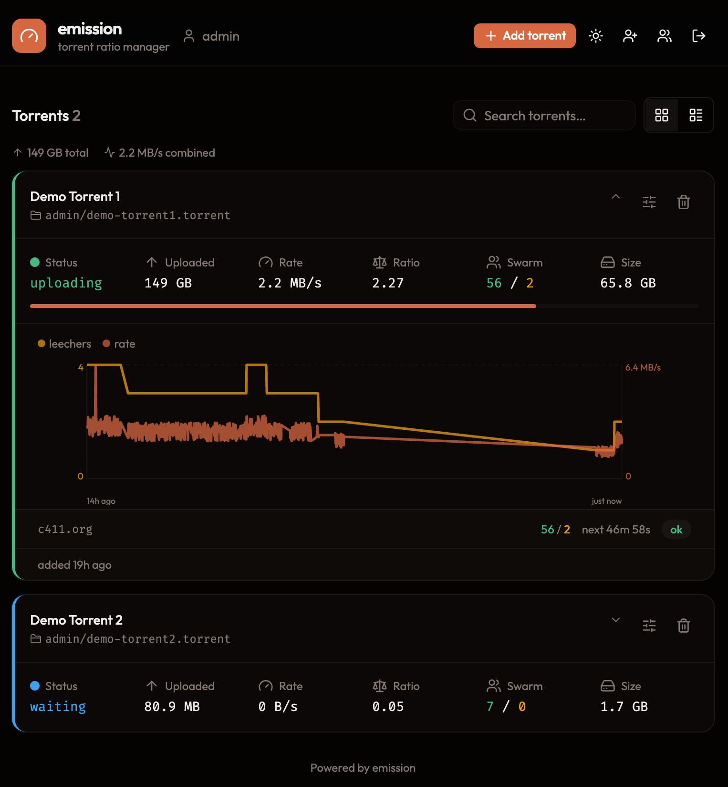

# emission

> **Disclaimer:** These 3 lines are the only thing written by a human on this project
> While not an advocate of vibe coding, I wanted to try it on a low risk, low impact project
> The process took some trial and error, but ultimately the goal of this app has been reached

Fools private BitTorrent trackers by spoofing announces, inflating your
ratio without transferring any real data. Impersonates real clients
(qBittorrent, Transmission, Deluge, µTorrent, and more) so the announces
blend in with legitimate peers.

> **Use at your own risk.** Most private trackers prohibit ratio manipulation.
> Getting caught may result in a permanent ban.

**Safety mechanisms built in:**
- Upload only accumulates when at least one leecher is in the swarm; rate is zero otherwise.
- Upload rate scales with leecher count (hyperbolic weighting) so traffic looks organic.
- Per-user upload bandwidth ceiling (`--client.bandwidth`) shared proportionally across that user's torrents.
- Three seeding profiles (stealth / normal / aggressive) control how steeply the rate ramps with leechers.
- Optional tracker proxy: a server-wide default (`--client.proxy`) that each user can override with their own in settings.
- Optional ratio cap (`--client.max-ratio`) stops accumulating once the target is hit.
- Optional auto-remove (`--client.autoremove`) deletes the torrent when the cap is reached.
- Tracker `min_interval` is respected — emission never announces more often than the tracker asks.
- Exponential backoff on tracker errors (doubles each failure, capped at 30 minutes).
- Clean "stopped" announce sent to each tracker on shutdown.
- Reports `downloaded = torrent size` (complete seeder from day one).

### How the rate is calculated

Each torrent targets a fraction of its max upload rate based on how many
leechers are in the swarm, using a hyperbolic curve:

```
rate = maxRate × L / (L + halfSaturation)
```

`L` is the leecher count and `halfSaturation` is the leecher count at which
the rate reaches half of `maxRate`. A preset sets it — **stealth** = 10 (only
ramps up in big swarms), **normal** = 4 (default), **aggressive** = 1 (near-max
on almost any demand) — or you can pick any value in between. The rate climbs
fast at first, then flattens
as it approaches `maxRate` — it never quite reaches it. A ±20% jitter is applied
each second so the traffic looks organic, and the per-user bandwidth ceiling
caps the sum across all of that user's torrents.

### Tracker proxying

By default emission announces directly. Set `--client.proxy` to route **all**
tracker traffic — for every user — through one proxy you control:

```sh
emission serve --client.proxy socks5://10.0.0.1:1080   # or http://, https://
```

Use a proxy you trust: tracker announce URLs can carry private-tracker secrets
(passkeys), so the proxy operator sees them. Free/public proxy lists are not a
good fit for this — point it at your own VPN gateway or SOCKS endpoint instead.



---

## Install

### Linux / macOS

Download the right archive for your platform from the
[releases page](https://github.com/jdel/emission/releases) and drop the
binary into `~/.local/bin`.

Adjust the URL for your platform/arch:

```sh
mkdir -p ~/.local/bin
curl -L https://github.com/jdel/emission/releases/latest/download/emission-linux-amd64.tar.gz \
  | tar -xz -C ~/.local/bin emission
```

`wget` works too:

```sh
wget -qO- https://github.com/jdel/emission/releases/latest/download/emission-linux-amd64.tar.gz \
  | tar -xz -C ~/.local/bin emission
```

Make sure `~/.local/bin` is on your `PATH`.

Most Linux distros add it automatically. On macOS (and some Linux setups)
you have to add it yourself — append the line below to your shell's
rc file:

```sh
# bash (~/.bashrc) or zsh (~/.zshrc, default on macOS):
export PATH="$HOME/.local/bin:$PATH"

# fish (~/.config/fish/config.fish):
fish_add_path $HOME/.local/bin
```

Open a new terminal (or `source` the rc file) and verify:

```sh
emission --help
```

### Windows

Grab `emission-windows-amd64.zip` from the releases page, unzip it, and run `emission.exe` from a terminal.

### Docker

Behind a Traefik reverse proxy with automatic HTTPS — see [`example/docker-compose/`](example/docker-compose/).

### Other install paths

- `go install github.com/jdel/emission@latest` — if you already have Go.
- Build from source — see [Building](#building).

---

## Get started

Run emission with the web UI:

```sh
emission serve --http.ui
```

It prints the URL it's listening on (something like
`http://localhost:8080`). Open that in your browser, then:

1. Click "Add torrent" to pick a `.torrent` file from your computer.
2. Click a torrent's slider icon to edit its max upload rate and ratio cap.
3. Click the trash icon to stop and delete a torrent.

`.torrent` files and their settings live under
`~/.local/share/emission/` (Linux) or
`~/Library/Application Support/emission/` (macOS) by default.
Override with `--storage.torrents <dir>`.

Press <kbd>Ctrl</kbd>+<kbd>C</kbd> in the terminal to stop emission.
The final "stopped" announces are sent to each tracker before exit.

emission impersonates **Transmission 4.0.6** by default.
To use a different client profile:

```sh
emission clients              # list every supported profile
emission serve --http.ui --client.name qbittorrent-4.4.2
```

---

## CLI-only mode (no web UI)

If you don't want the web UI — for example on a headless server
seeded by another tool that drops `.torrent` files into a folder —
use `seed`:

```sh
emission seed                       # default folder, default bandwidth (1M)
emission seed --storage.torrents /srv/torrents \
              --client.bandwidth 2M \
              --client.max-ratio 2.0
```

Every flag is also an env var (`EMISSION_CLIENT_BANDWIDTH=2M`) and can
live in a config file — see [Configuration](#configuration).

---

## Exposing emission publicly

The defaults are tuned for `localhost`. To put emission on the public
internet:

1. Turn auth on with `--http.auth` and set `--http.public-url` to the
   URL the browser will use. See [Authentication](#authentication).
2. Terminate TLS in front of emission (reverse proxy or direct).

### Behind a reverse proxy (recommended)

Let Traefik / Caddy / nginx handle the certificate. The Docker example
in [`example/docker-compose/`](example/docker-compose/) does this with
Traefik and Let's Encrypt.

> **Warning:** when running behind a reverse proxy, set
> `--http.trusted-proxies` (or `EMISSION_HTTP_TRUSTED_PROXIES`) to the
> proxy's subnet. Without it the rate limiter sees the proxy's IP for
> every request — all clients share one bucket, the burst exhausts
> immediately, and legitimate users get 429s. The bundled Docker Compose
> example sets this automatically.

### Direct TLS

If you have a certificate already (e.g. from `certbot`):

```sh
emission serve \
  --http.ui \
  --http.port 8443 \
  --http.tls.enabled \
  --http.tls.cert /etc/letsencrypt/live/example.com/fullchain.pem \
  --http.tls.key  /etc/letsencrypt/live/example.com/privkey.pem \
  --http.auth \
  --http.public-url https://emission.example.com:8443
```

---

## Commands

| Command | Description |
|---------|-------------|
| `emission seed` | CLI-only watcher — no API, no auth, no state file |
| `emission serve` | Watcher + HTTP API + optional web UI and auth |
| `emission clients` | List all available client profiles |
| `emission where` | Print resolved data and config locations |

### Common flags (both `seed` and `serve`)

| Flag | Env var | Description |
|------|---------|-------------|
| `--storage.torrents`  | `EMISSION_STORAGE_TORRENTS`  | Directory to watch (default: `~/.local/share/emission/torrents`) |
| `--client.name`       | `EMISSION_CLIENT_NAME`       | Client profile to impersonate (default: `transmission-4.0.6`) |
| `--client.bandwidth`  | `EMISSION_CLIENT_BANDWIDTH`  | Per-user upload bandwidth ceiling, shared proportionally across that user's torrents and used as each new torrent's default max (default: `1M`) |
| `--client.max-peers`  | `EMISSION_CLIENT_MAX_PEERS`  | Peers to request per tracker (`0` = client default) |
| `--client.max-ratio`  | `EMISSION_CLIENT_MAX_RATIO`  | Stop accumulating upload at N × torrent size (`0` = unlimited) |
| `--client.autoremove` | `EMISSION_CLIENT_AUTOREMOVE` | Remove the torrent automatically when the ratio cap is reached (default: `false`) |
| `--client.proxy`      | `EMISSION_CLIENT_PROXY`      | Route all tracker traffic through this proxy (`http`/`https`/`socks5`); empty = announce directly (default: empty) |
| `--log-level`         | `EMISSION_LOG_LEVEL`         | Log verbosity: `trace`, `debug`, `info`, `warn`, `error` (default: `info`) |
| `--config`            | `EMISSION_CONFIG`            | Config file path (auto-discovered if unset) |

### `serve`-only flags

| Flag | Env var | Description |
|------|---------|-------------|
| `--storage.auth`     | `EMISSION_STORAGE_AUTH`     | Passkey credential file (default: `~/.local/share/emission/auth.json`) |
| `--http.auth`        | `EMISSION_HTTP_AUTH`        | Require passkey authentication |
| `--http.api`         | `EMISSION_HTTP_API`         | Serve the JSON API |
| `--http.ui`          | `EMISSION_HTTP_UI`          | Serve the web UI (implies `--http.api`) |
| `--http.port`        | `EMISSION_HTTP_PORT`        | HTTP port (default: `8080`) |
| `--http.tls.enabled` | `EMISSION_HTTP_TLS_ENABLED` | Serve over HTTPS |
| `--http.tls.cert`    | `EMISSION_HTTP_TLS_CERT`    | TLS certificate PEM (required with `--http.tls.enabled`) |
| `--http.tls.key`     | `EMISSION_HTTP_TLS_KEY`     | TLS private key PEM (required with `--http.tls.enabled`) |
| `--http.public-url`  | `EMISSION_HTTP_PUBLIC_URL`  | Meaning depends on auth mode — see below |
| `--http.trusted-proxies` | `EMISSION_HTTP_TRUSTED_PROXIES` | Comma-separated CIDRs whose `X-Forwarded-For` is trusted for rate limiting (e.g. `172.16.0.0/12`). Set to the reverse proxy's subnet when emission is behind a proxy — leaving this empty causes all clients to share the proxy's IP bucket. Only set when **all** traffic genuinely transits the proxy. |

#### `--http.public-url` behavior

The meaning of `--http.public-url` depends on whether `--http.auth` is enabled.

**With `--http.auth` (required).** A single canonical external URL
(`scheme://host[:port]`). Used for the passkey (WebAuthn) origin, the
`Secure` cookie flag, and invite links — it must exactly match what
the browser sees. No wildcards.

```sh
emission serve --http.auth --http.public-url https://emission.example.com
```

**Without `--http.auth` (LAN / trusted-network use).** Reused to
control which browser origins the live-stats WebSocket accepts.
Takes a comma-separated list of origin host patterns (`host:port`).
`*` works as a glob within a pattern. `localhost` is always accepted.
Omit the flag and only same-machine browsers can connect to the stats
feed.

```sh
# one fixed LAN address
emission serve --http.ui --http.public-url 10.0.0.12:8080

# a whole LAN subnet plus a local DNS name
emission serve --http.ui --http.public-url "10.0.0.*:8080,*.lan:8080"
```

Each pattern must match the browser's address bar (host and port).
A bare `*` is ignored — it would accept any website's cross-origin
connection. Only run an auth-off instance on a network you trust.

---

## API

`serve --http.api` exposes a JSON REST API.

Interactive docs at `/docs` (Swagger UI).
Full spec at `/docs/swagger.json`.

```
GET    /api/torrents               list torrents (paged: ?limit, ?offset, ?q)
POST   /api/torrents               upload a .torrent (multipart: file, max-speed, max-ratio)
GET    /api/torrents/{id}/stats    rate/leecher history for one torrent
PATCH  /api/torrents/{id}          update per-torrent overrides {maxSpeed, maxRatio, deleteOnCap}
DELETE /api/torrents/{id}          stop and remove a torrent
GET    /api/ws                     WebSocket: live stats + list-changed events
GET    /api/bandwidth              caller's own upload bandwidth + seeding profile
PUT    /api/bandwidth              update caller's own bandwidth + profile
GET    /api/auth/status            auth state
POST   /api/auth/login/begin       passkey login (WebAuthn)
POST   /api/auth/invite            create invite link (any authenticated user)
PUT    /api/auth/users/{u}/bandwidth   set another user's bandwidth (admin)
...                                full spec at /docs
```

The WebSocket pushes several message types:
- `{type:"stats", torrents:[…]}` — live snapshot of every visible torrent, ~once per second.
- `{type:"changed"}` — torrent list added or removed.
- `{type:"stats_history", history:{<id>:[…]}}` — full rate/leecher history on connect.
- `{type:"stat_point", id:"…", point:{…}}` — one new history data point (~every 30 s).

---

## Authentication

**Off by default.** With auth off, anyone who reaches the port can use
emission. For local-only or LAN-only use, that's fine.

For anything reachable from the public internet, turn it on:

```sh
emission serve --http.ui --http.auth --http.public-url https://your.host
```

emission uses **passkeys** — the same passwordless login your phone
uses ("sign in with Face ID / fingerprint / Windows Hello / a USB
security key").

No passwords, no email, no SMS. The browser talks to your device's
authenticator; emission only sees the public part. Any modern browser
supports passkeys.

### First-time setup (the bootstrap window)

The first 15 minutes after emission starts — and only while no admin
exists — the operator can register the admin device at the dedicated
`/start` URL. That's how you bootstrap.

- **On a fresh install** (no users yet) emission redirects the public
  URL straight to `/start` for convenience. Open `--http.public-url`
  within 15 minutes and complete the passkey prompt — you're now the
  admin.
- **Re-opening the window** (e.g. admin device lost): delete the
  admin's credential entry and restart. Other users keep their accounts
  and see the normal login screen; only the operator who knows the
  `/start` URL sees the registration page. The fresh-install redirect
  does not fire when other users still exist.
- **Missed the window?** Restart emission. As long as no admin is
  registered, a new 15-minute window opens.
- **Lost your admin device after registering?** Delete the credential
  file (default: `~/.local/share/emission/auth.json`) and restart.
  Next startup opens a fresh bootstrap window.

### Day-to-day

- **Admin** (`admin`) is a fixed user — one or more devices, sees
  every torrent, manages users and per-user bandwidth. Cannot be
  deleted.
- **Inviting other users.** Any authenticated user can click "Invite"
  in the UI, enter a username, and get a one-time link (and a 3-word
  code). Send the link to the new user; they open it and register
  their own device. Codes expire in 24 hours.
- **Per-user bandwidth + seeding profile.** Every user has an upload
  bandwidth ceiling and a seeding profile (stealth / normal /
  aggressive). Users edit their own; admins edit anyone's. Each
  torrent defaults its max upload rate to its owner's bandwidth.
- **Per-user storage.** Uploads go to `<storage.torrents>/<username>/`.
  Each user sees only their own torrents plus anything in the root
  (shared by the admin); the admin can filter the torrent list by user.
- **Sessions** are HttpOnly + SameSite=Strict cookies with a sliding
  7-day expiry. Restart clears all sessions; users log in again.

### What's stored about you

The credential file holds only what WebAuthn needs to recognise your
device on the next login:

- The username the admin (or you) picked at registration.
- The date the device was registered.
- The public key of your passkey, plus the authenticator's model
  identifier (the same value any site that uses passkeys sees — it
  identifies "Yubikey 5", "Apple Touch ID", etc., not your specific
  device).
- An internal counter the protocol uses to detect cloned credentials.

What is **not** stored: no IP addresses, no email, no phone number,
no browser fingerprint, no geolocation, no usage logs.

emission does not "phone home" or report to any third party.

### Cookies

emission sets exactly one cookie, `emission_session`, when you log in.
It holds a random session token — no personal data, no tracking
identifier.

It's marked `HttpOnly` (JavaScript cannot read it) and
`SameSite=Strict` (browsers refuse to send it from other sites). The
cookie is dropped on logout, on emission restart, or after seven days
of inactivity.

---

## Configuration

Priority order (lowest → highest):

```
flag default → config file → EMISSION_* env var → explicit flag
```

Config file: `emission.{yaml,toml,json}`, searched in `.` then
`~/.config/emission/` (XDG). Override with `--config`.

```yaml
# emission.yaml example
storage:
  torrents: ~/torrents
client:
  name: transmission-4.0.6
  bandwidth: 1M
  max-ratio: 2.0
http:
  ui: true
  auth: true
  port: 8080
  public-url: https://emission.example.com
  tls:
    enabled: true
    cert: /etc/ssl/cert.pem
    key: /etc/ssl/key.pem
log-level: info
```

Env var mapping: `EMISSION_` prefix, dots and dashes → underscores.

`--client.bandwidth` = `EMISSION_CLIENT_BANDWIDTH`,
`--http.port` = `EMISSION_HTTP_PORT`.

---

## Project layout

```
main.go                CLI entry point — calls into cmd
cmd/                   Cobra commands (root, seed, serve, clients) + HTTP handlers
internal/auth/         Passkey/WebAuthn auth (credentials, sessions, invites)
internal/bencode/      Bencode decoder
internal/client/       BitTorrent client identity generator (85+ profiles)
internal/docs/         Generated Swagger spec (from `make swagger`)
internal/seeder/       Seeding engine — Manager + per-torrent sessions
internal/torrent/      .torrent metadata parser
internal/tracker/      HTTP tracker announce
internal/units/        Human-readable rate parser/formatter
internal/web/          Embeds the built web UI
ui/                    React 19 + Tailwind v4 + shadcn/ui web frontend
example/               Sample deployments (docker-compose + traefik)
```

---

## Building

### Prerequisites

- Go **1.26.2+**
- Node **20+** and npm
- `make`

### From source

```sh
git clone https://github.com/jdel/emission
cd emission
make build
./emission --help
```

`make build` runs the UI build (npm ci + vite) into `internal/web/dist`
then `go build` with `-trimpath` and the version string baked in.

### Cross-compilation

```sh
make dist          # builds for linux/{amd64,arm64}, darwin/{amd64,arm64}, windows/amd64
                   # output: dist/<os>/<arch>/emission[.exe]
```

### Docker

```sh
make docker        # multi-arch buildx image (linux/amd64, linux/arm64)
                   # add PUSH=1 to push to $(IMAGE)
make docker-load   # single-arch image loaded into local Docker
```

### Make targets

```sh
make test          # go test ./cmd/... ./internal/...
make vet           # go vet ./cmd/... ./internal/...
make build         # build the binary
make ui            # build only the React UI into internal/web/dist
make dist          # cross-compile matrix
make swagger       # regenerate internal/docs from handler godoc annotations
make sync-clients  # regenerate internal/client/clients/*.json from upstream
make docker        # multi-arch docker image
make clean         # remove dist/ and ./emission
```

## Development

Live UI dev (proxies `/api` to a running `emission serve --http.api`):

```sh
cd ui && npm run dev
```

The vite dev server runs on `localhost:5173` and proxies API calls + the
WebSocket to your local backend.

### Client profiles

```sh
emission clients                   # list all 85+ profiles
```

Add new profiles by dropping `.json` files into `internal/client/clients/`.

---

## License

[BSD 2-Clause](LICENSE)
